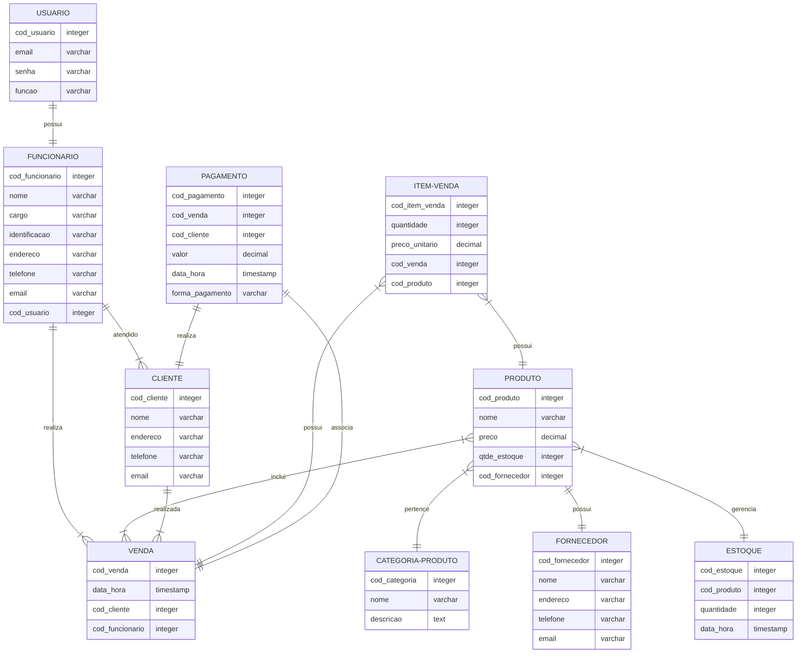

# Documento de Modelos

Neste documento temos o modelo de Dados (Entidade-Relacionamento). Temos também a descrição das entidades e o dicionário de dados.

## Modelo Conceitual

Para a construção do modelo conceitual (Entidade-Relacionamento) utilizou-se a tecnologia **Mermaid**.

## Descrição das Entidades

O modelo conceitual do sistema de gestão **CONSTRUCT** incluirá as seguintes entidades:

### Entidade: Usuário
* A entidade "Usuário" representa os usuários do sistema.
* Possui atributos como ID, e-mail, senha e função (indicando se é um usuário de TI ou funcionário).
### Entidade: Funcionário
* A entidade "Funcionário" representa os funcionários da loja.
* Possui atributos como ID, nome, sobrenome, e-mail e cargo (indicando se é um gerente, vendedor ou outro cargo específico).
### Entidade: Fornecedor
* A entidade "Fornecedor" representa as empresas ou indivíduos que fornecem os materiais de construção para a loja.
* Possui atributos como ID, nome, contato e endereço.
* Não interage diretamente com o sistema, mas é gerenciado pelo funcionário (gerente).
### Entidade: Cliente
* A entidade "Cliente" representa os indivíduos ou empresas que realizam compras na loja.
* Possui atributos como ID, nome, contato e endereço.
* Está associada ao funcionário(gerente, vendedor) responsável por meio de um relacionamento de "atendido por".
### Entidade: Produto
* A entidade "Produto" representa os materiais de construção disponíveis na loja.
* Possui atributos como ID, nome, descrição, preço e quantidade em estoque.
### Entidade: Categoria-Produto
* A entidade "Categoria-Produto" representa as diferentes categorias ou tipos de produtos disponíveis na loja.
* Possui atributos como ID e nome da categoria.
### Entidade: Venda
* A entidade "Venda" representa as transações de vendas realizadas na loja.
* Possui atributos como ID da venda, data, valor total, informações de pagamento, e outras informações relevantes relacionadas à venda.
### Entidade: Item-Venda
* A entidade "Item-Venda" representa os produtos específicos vendidos em cada transação de venda.
* Possui atributos como ID do item-venda, quantidade, preço unitário e quaisquer outros detalhes relevantes relacionados ao produto vendido.
### Entidade: Estoque
* A entidade "Estoque" representa o inventário dos produtos disponíveis na loja.
* Possui atributos como ID do produto, quantidade disponível, data de entrada, data de saída e quaisquer outros detalhes relevantes relacionados ao controle de estoque.
### Entidade: Pagamento
* A entidade "Pagamento" representa as informações referentes aos pagamentos efetuados pelos clientes durante as transações de venda.
* Possui atributos como ID do pagamento, valor, método de pagamento (por exemplo, dinheiro, cartão de crédito) e outras informações relevantes relacionadas ao pagamento.

## Dicionário de Dados

Dicionário de dados centraliza informações sobre o conjunto de dados (dataset) sob análise. Seu propósito é melhorar a comunicação entre todos os envolvidos no projeto, além de ser um repositório (documento) que descreve de forma estruturada, o significado, origem, relacionamento e uso dos dados.

## Tabela: Usuário

| Atributo   | Chave | Tipo de dado | Tamanho | Descrição                                     |
| ---------- | :---: | :----------: | :-----: | --------------------------------------------- |
| cod_usuario|  PK   |   INTEGER    |    4    | Identificador incremental de usuário.         |
| username   |  NN   | VARCHAR[16]  |   16    | Email formato local-part@domain - - RFC 5322. |     
| senha      |  NN   | VARCHAR[10]  |   10    | Senha do usuário. |

## Tabela: Funcionário

| Atributo  | Chave | Tipo de dado | Tamanho | Descrição                                     |
| --------- | :---: | :----------: | :-----: | --------------------------------------------- |

## Tabela: Fornecedor

| Atributo  | Chave | Tipo de dado | Tamanho | Descrição                                     |
| --------- | :---: | :----------: | :-----: | --------------------------------------------- |

## Tabela: Cliente

| Atributo  | Chave | Tipo de dado | Tamanho | Descrição                                     |
| --------- | :---: | :----------: | :-----: | --------------------------------------------- |

## Tabela: Produto

| Atributo  | Chave | Tipo de dado | Tamanho | Descrição                                     |
| --------- | :---: | :----------: | :-----: | --------------------------------------------- |

## Tabela: Categoria-Produto

| Atributo  | Chave | Tipo de dado | Tamanho | Descrição                                     |
| --------- | :---: | :----------: | :-----: | --------------------------------------------- |

## Tabela: Venda

| Atributo  | Chave | Tipo de dado | Tamanho | Descrição                                     |
| --------- | :---: | :----------: | :-----: | --------------------------------------------- |

## Tabela: Item-Venda

| Atributo  | Chave | Tipo de dado | Tamanho | Descrição                                     |
| --------- | :---: | :----------: | :-----: | --------------------------------------------- |

## Tabela: Estoque

| Atributo  | Chave | Tipo de dado | Tamanho | Descrição                                     |
| --------- | :---: | :----------: | :-----: | --------------------------------------------- |

## Tabela: Pagamento

| Atributo  | Chave | Tipo de dado | Tamanho | Descrição                                     |
| --------- | :---: | :----------: | :-----: | --------------------------------------------- |

